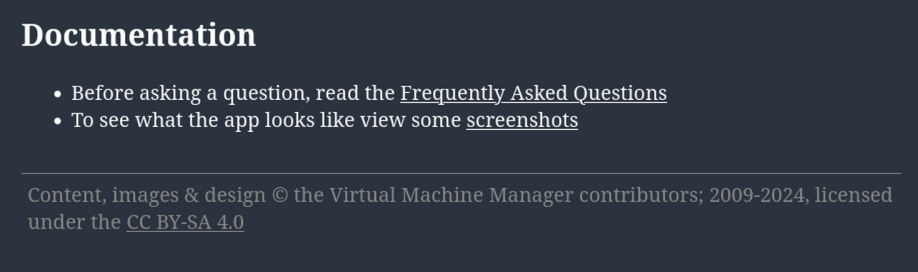

# Documentation Wall of Shame

## Sphinx 
The very software this website is built with somehow does not include *any* 
instructions or examples on how to include images. The best available example
is [on pythontutorials.net](https://www.pythontutorials.net/blog/getting-image-appearing-properly-in-readme-file-using-include-with-sphinx/).

## [Virtual Machine Manager](https://virt-manager.org/documentation.html)
There is no documentation at all, other than the FAQs and a few screenshots. 

